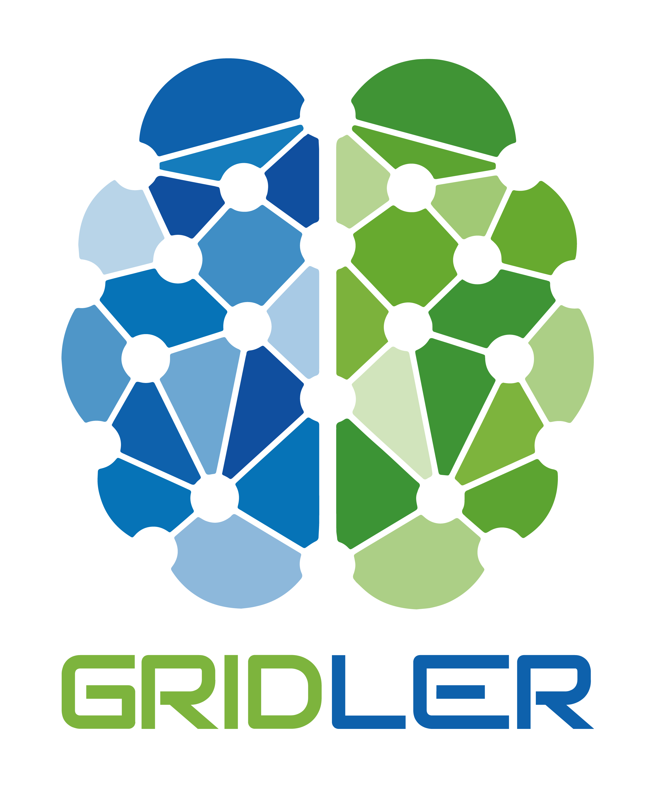
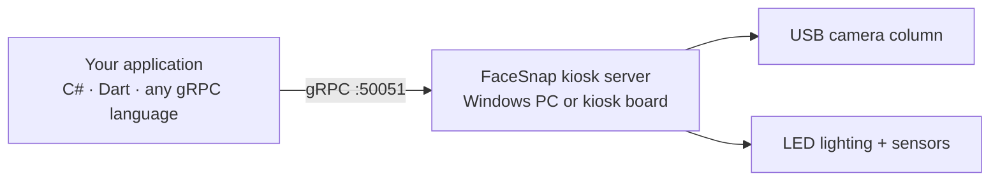

<div align="center">



# FaceSnap

**Example clients for the FaceSnap photo kiosk — ICAO-compliant document photos over gRPC.**

[](https://github.com/Gridler-tech/face_snap_demo/actions/workflows/dotnet.yml)
<!-- Static while the repo is private (shields cannot see private release data);
     switch to img.shields.io/github/v/release/Gridler-tech/face_snap_demo when public.
     Bump the version here with each release. -->
[](https://github.com/Gridler-tech/face_snap_demo/releases)
[](https://gridler-tech.github.io/face_snap/)
[](csharp_sample)
[](flutter_apps/operator_app)

[Product page](https://www.gridler.com/gridler-facesnap/) ·
[Getting started](https://gridler-tech.github.io/face_snap/docs/getting-started.html) ·
[API reference](https://gridler-tech.github.io/face_snap/api/GrpcLibrary.html) ·
[Releases](https://github.com/Gridler-tech/face_snap_demo/releases) ·
[Changelog](changelog.md)

</div>

---

## What is FaceSnap?

[FaceSnap](https://www.gridler.com/gridler-facesnap/) is Gridler's multi-camera photo
kiosk for official document photos. The kiosk
server — on a Windows PC or a Linux kiosk board — drives the camera column and the LED
lighting, checks every shot against the ICAO quality rules as it is taken, and delivers
the finished photo. Clients talk to it over gRPC; this repository shows how.



## What's in this repository

| Folder | Contents |
|---|---|
| [`library/`](library) | The .NET client SDK: `GrpcLibrary.dll` with XML docs, plus its Grpc/Protobuf dependencies — the same binaries every release ships |
| [`csharp_sample/`](csharp_sample) | Minimal C# console client: connect, read the kiosk info and settings, run one automatic capture, save the photo and verify it with face recognition — the getting-started guide as a runnable program |
| [`flutter_apps/operator_app`](flutter_apps/operator_app) | The full Flutter operator app (Windows desktop): server discovery and control, capture, face recognition, calibration, monitoring, settings |

## Quick start (C#)

```csharp
using GrpcLibrary;
using GrpcLibrary.Dto;

// Point the shared channel at the server (skip for a local server on 50051).
GrpcChannelProvider.SetAddress("http://192.168.1.50:50051");

var kiosk = new KioskProcessor();
await foreach (var item in kiosk.StartAutomaticProcess())
{
    switch (item)
    {
        case ProcessStatus s: Console.WriteLine($"{s.description}: {s.status}"); break;
        case ImageData img:   File.WriteAllBytes("photo.jpg", img.data);         break;
    }
}
```

Or run the complete sample against your kiosk (requires the .NET 8 SDK or later):

```
dotnet run --project csharp_sample -- http://<server>:50051
```

## The operator app

| Page | What it does |
|---|---|
| **Kiosk** | Find servers on the network or add one manually; start/stop the server on this PC or on a remote kiosk board over SSH |
| **Capture** | Run the automatic or manual capture process with live ICAO check results |
| **Photo** | Photo format, cropping, background erasing, JPEG quality |
| **Lighting** | LED intensities, layouts, focus light, white-point auto-tune |
| **Camera** | Resolutions, previews, camera properties and distance measurement |
| **Calibration** | Camera positions, expected camera count and focus calibration |
| **Face recognition** | Compare captured photos against a reference photo (Dlib, Facenet512, SFace) |
| **Monitoring** | Kiosk status, live usage stream and light-sensor readings |

> [!TIP]
> The operator app has a **Developer mode**: switch it on and every page shows `</>`
> badges that open an implementation popup for that control — the gRPC call behind it,
> ready-to-copy C# and Dart snippets, and a link into the API reference.

Build it with the Flutter SDK (Windows desktop support enabled):

```
cd flutter_apps/operator_app
flutter build windows
```

## Releases

Each [release](https://github.com/Gridler-tech/face_snap_demo/releases) ships:

- the `GrpcLibrary` artifacts (`GrpcLibrary.dll` + XML docs and dependencies),
- `FaceSnapOperatorSetup-<version>.exe` — signed Windows installer of the operator app
  (per-user, no admin rights needed),
- `FaceSnapUpdaterSetup-<version>.exe` — signed Windows installer of the fleet updater,
  which finds and provisions kiosk boards and deploys server images. The updater ships
  as an installer only; its source is not part of this repository.

> [!NOTE]
> The former .NET MAUI demo app was removed in September 2026 — it was superseded by
> the Flutter operator app and the C# sample. It remains available in the git history.

## Documentation

The SDK documentation lives at **https://gridler-tech.github.io/face_snap/** —
[getting started](https://gridler-tech.github.io/face_snap/docs/getting-started.html),
the full [API reference](https://gridler-tech.github.io/face_snap/api/GrpcLibrary.html),
and the SDK [changelog](changelog.md).
