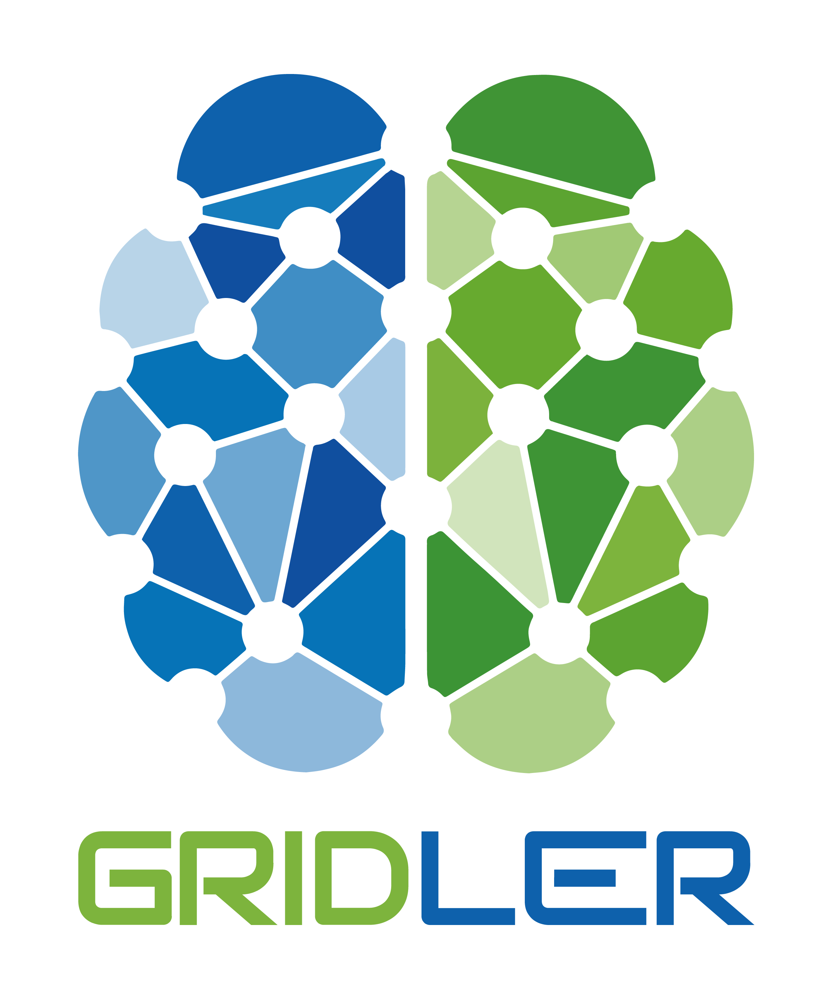
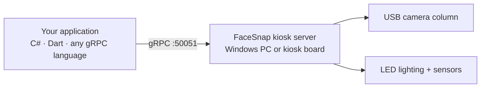

<div align="center">



# FaceSnap

**Example clients for the FaceSnap photo kiosk — ICAO-compliant document photos over gRPC.**

[](https://github.com/Gridler-tech/face_snap_demo/actions/workflows/dotnet.yml)
[](https://github.com/Gridler-tech/face_snap_demo/releases)
[](https://gridler-tech.github.io/face_snap/)
[](csharp_sample)
[](flutter_apps/operator_app)

[Product page](https://www.gridler.com/gridler-facesnap/) ·
[Getting started](https://gridler-tech.github.io/face_snap/docs/getting-started.html) ·
[API reference](https://gridler-tech.github.io/face_snap/api/GrpcLibrary.html) ·
[Releases](https://github.com/Gridler-tech/face_snap_demo/releases) ·
[Changelog](changelog.md)

</div>

---

## What is FaceSnap?

[FaceSnap](https://www.gridler.com/gridler-facesnap/) is Gridler's photo kiosk for
official document photos — passport, ID and other government formats. A column of
cameras at different heights photographs every person straight-on, seated or standing,
with no height adjustment: the kiosk selects the best camera for the subject
automatically. The kiosk server — on a Windows PC or a Linux kiosk board — does all
the heavy lifting; clients talk to it over gRPC, and this repository shows how.

What the kiosk server takes care of:

- **Automatic capture** — face detection picks the best camera, guides the subject
  into position (distance and pose), and takes the photo hands-free
- **Live ICAO/OFIQ quality checks** while capturing: eyes open, neutral expression,
  gaze, head pose and size, sharpness, lighting evenness, red-eye, glasses
- **Controlled LED lighting** — calibrated white point, glare-safe mode for glasses,
  and a light sensor for closed-loop tuning
- **Document formats** — ICAO 35×45 passport, US 2×2, CA 50×70 and ISO enrolment
  framing, with automatic cropping and background erasing to a configurable colour
- **Face verification** — compare the captured photo against a reference (e.g. the
  photo in a passport) with Dlib, Facenet512 or SFace models
- **Fleet friendliness** — kiosks announce themselves on the network over mDNS, and
  the full configuration is remotely operable through the same gRPC API


```mermaid
flowchart LR
    A["Your application<br/>C# · Dart · any gRPC language"] -- "gRPC :50051" --> S["FaceSnap kiosk server<br/>Windows PC or kiosk board"]
    S --> C["USB camera column"]
    S --> L["LED lighting + sensors"]
```

## What's in this repository

| Folder | Contents |
|---|---|
| [`library/`](library) | The .NET client SDK: `GrpcLibrary.dll` with XML docs, plus its Grpc/Protobuf dependencies — the same binaries every release ships |
| [`csharp_sample/`](csharp_sample) | Minimal C# console client: connect, read the kiosk info and settings, run one automatic capture, save the photo and verify it with face recognition — the getting-started guide as a runnable program |
| [`flutter_apps/face_snap_grpc`](flutter_apps/face_snap_grpc) | The Dart client SDK: generated gRPC stubs for all six FaceSnap services, the shared channel provider and capture-stream helpers, plus small command-line examples |
| [`flutter_apps/operator_app`](flutter_apps/operator_app) | The full Flutter operator app (Windows desktop): server discovery and control, capture, face recognition, calibration, monitoring, settings — built on `face_snap_grpc` |
| [`csharp_maui_legacy/`](csharp_maui_legacy) | The original version-1 operator app (.NET MAUI, frozen July 2026) — legacy/unsupported, kept for customers who built on the v1 C# code; see its readme |

## Quick start (C#)

```csharp
using GrpcLibrary;
using GrpcLibrary.Dto;

// Point the shared channel at the server (skip for a local server on 50051).
GrpcChannelProvider.SetAddress("http://192.168.1.50:50051");

var kiosk = new KioskProcessor();
await foreach (var item in kiosk.StartAutomaticProcess())
{
    switch (item)
    {
        case ProcessStatus s: Console.WriteLine($"{s.description}: {s.status}"); break;
        case ImageData img:   File.WriteAllBytes("photo.jpg", img.data);         break;
    }
}
```

Or run the complete sample against your kiosk (requires the .NET 8 SDK or later):

```
dotnet run --project csharp_sample -- http://<server>:50051
```

## Quick start (Dart)

```dart
import 'dart:io';
import 'package:face_snap_grpc/face_snap_grpc.dart';

Future<void> main() async {
  await GrpcChannelProvider.setAddress('192.168.1.50', 50051);
  await for (final event in startAutomaticCapture()) {
    switch (event) {
      case CaptureStatus(:final description, :final status):
        print('$description: $status');
      case CapturePhoto(:final bytes):
        File('photo.jpg').writeAsBytesSync(bytes);
      case CameraPhoto():
        break; // manual captures only
    }
  }
  exit(0);
}
```

Add the SDK to your own Dart or Flutter project as a path dependency
(`face_snap_grpc: {path: <clone>/flutter_apps/face_snap_grpc}`), or run one of its
examples (requires the Dart or Flutter SDK):

```
cd flutter_apps/face_snap_grpc
dart pub get
dart run example/capture_once.dart <server> photo.jpg
```

## The operator app

| Page | What it does |
|---|---|
| **Kiosk** | Find servers on the network or add one manually; start/stop the server on this PC or on a remote kiosk board over SSH |
| **Capture** | Run the automatic or manual capture process with live ICAO check results |
| **Photo** | Photo format, cropping, background erasing, JPEG quality |
| **Lighting** | LED intensities, layouts, focus light, white-point auto-tune |
| **Camera** | Resolutions, previews, camera properties and distance measurement |
| **Calibration** | Camera positions, expected camera count and focus calibration |
| **Face recognition** | Compare captured photos against a reference photo (Dlib, Facenet512, SFace) |
| **Monitoring** | Kiosk status, live usage stream and light-sensor readings |
| **Updater** (Developer mode) | Fleet tool: find kiosk boards, deploy a server image to one or many, back up / restore / remove an installation |

> [!TIP]
> The operator app has a **Developer mode**: switch it on and every page shows `</>`
> badges that open an implementation popup for that control — the gRPC call behind it,
> ready-to-copy C# and Dart snippets, and a link into the API reference.

### The Updater — how a server update works

The **Updater** page (visible in Developer mode) is the fleet tool for the Linux kiosk
boards. It talks to a board over SSH — you are prompted for the credentials once; they
are kept in the app's own `config.json` — and every action runs as a visible pipeline
of steps with a log and a summary. **Search** finds provisioned kiosks by their
`_facesnap._tcp` mDNS announcement (`facesnap-<mac>.local`) and also detects *clean*
vendor boards by probing their stock hostnames over mDNS and LLMNR; a board can always
be added by IP address instead.

**Update server** (one board, or a batch) runs these steps:

1. **Connect to the kiosk** — open the SSH session.
2. **Inspect the current installation** — board type and OS, installed server image,
   compose file, auto-start unit. Only POSIX commands are used, so it works on both
   the Ubuntu (Odroid) and Arch (Radxa) images.
3. **Set up a clean board** — if Docker is missing (a fresh vendor image), it is
   installed and enabled; on old kernels this can require one automatic reboot.
   Skipped on a provisioned kiosk.
4. **Pre-update checks** — compares the running version with the new image tag and
   checks free disk space.
5. **Back up settings and configuration** — the kiosk's `data/` (settings, camera
   calibration) and compose file are packed into a `.tgz` and downloaded to the
   operator PC; nothing is left behind on the board.
6. **Stop the server** — the auto-start unit and any running FaceSnap containers.
7. **Make room** — on a small eMMC that cannot hold the old and new image together,
   the old image is removed first. This trades away automatic rollback; the step
   says so explicitly when it happens.
8. **Install the new server image** — the `docker save` tar is **streamed from the
   operator PC straight into `docker load`**; it is never stored on the eMMC, which
   is what makes 16 GB boards updatable.
9. **Update the start-up configuration** — writes the `docker-compose.yml` for the
   new image and the auto-start service; a first-generation installation is migrated
   to the current `data/` layout on the way (the old files stay in place, so a
   downgrade keeps working).
10. **Apply the settings profile** — if the image ships one: a small JSON that moves
    settings that were merely *defaults of their era* (capture resolution, enabled
    checks, …) to the new generation's values, while everything the kiosk owns
    (calibration, per-camera tuning, LED layout, photo format) is carried across
    untouched.
11. **Provision kiosk identity** — hostname `facesnap-<MAC>` plus the
    `_facesnap._tcp` mDNS service, so the kiosk shows up in **Search** from now on.
    Best-effort: a board without avahi still updates fine.
12. **Start the server** — auto-start unit enabled and started.
13. **Verify the new server** — waits for the server's own *ready* marker in the
    container log (an open port 50051 is not proof: Docker listens there before the
    server has finished booting).
14. **Clean up** — temporary files and, when space allowed keeping it, nothing else;
    the summary states the installed version.

A **batch** update first pre-flights *every* selected board (unreachable or
ineligible boards are listed and excluded before anything is touched), then runs the
same pipeline per board with a small concurrency cap and produces one combined report.

The other actions reuse the same machinery: **Backup** is read-only (the server keeps
running); **Restore** puts a backup's `data/` back but deliberately *not* its compose
file (that is infrastructure owned by the updater — an old copy could point at an
image that is no longer on the kiosk); **Remove** uninstalls service, containers and
images, keeps the configuration files unless told otherwise, and can take a backup
first. **Get server info** is a read-only inspection.

Everything is also scriptable headlessly — the same engines drive the CLIs in
`flutter_apps/operator_app/bin/`: `updater_cli`, `batch_cli`, `backup_cli`,
`restore_cli`, `remove_cli`, `info_cli`, `discover_cli`
(`dart run bin/updater_cli.dart <host> <user> <password> <image.tar>`).
The server images themselves are not distributed in this repository.

Build it with the Flutter SDK (Windows desktop support enabled):

```
cd flutter_apps/operator_app
flutter build windows
```

## Releases

Each [release](https://github.com/Gridler-tech/face_snap_demo/releases) ships:

- the `GrpcLibrary` artifacts (`GrpcLibrary.dll` + XML docs and dependencies),
- `FaceSnapOperatorSetup-<version>.exe` — signed Windows installer of the operator app
  (per-user, no admin rights needed). Since 1.1.9 it includes the former fleet updater
  as the **Updater** page (Developer mode): it finds kiosk boards on the network,
  provisions clean ones, deploys server images — one board or a batch — and backs up,
  restores or removes an installation. Its source is in `flutter_apps/operator_app/`
  (`lib/updater/`, with headless command-line tools under `bin/`). The server images
  themselves are not distributed here.

> [!NOTE]
> The former .NET MAUI demo app was removed in September 2026 — it was superseded by
> the Flutter operator app and the C# sample.

## Documentation

The SDK documentation lives at **https://gridler-tech.github.io/face_snap/** —
[getting started](https://gridler-tech.github.io/face_snap/docs/getting-started.html),
the full [API reference](https://gridler-tech.github.io/face_snap/api/GrpcLibrary.html),
and the SDK [changelog](changelog.md).

## License

The sample and application source code in this repository is licensed under the
**MIT License**; the `GrpcLibrary` SDK binaries in [`library/`](library) are
proprietary © Gridler — see [license.md](license.md) for both. The `library/`
folder redistributes open-source components (gRPC for .NET, Protocol Buffers,
Microsoft.Extensions), and FaceSnap itself is proudly built with open source —
.NET, Flutter/Dart, gRPC, OpenCV and more. See
[third_party_notices.md](third_party_notices.md).
